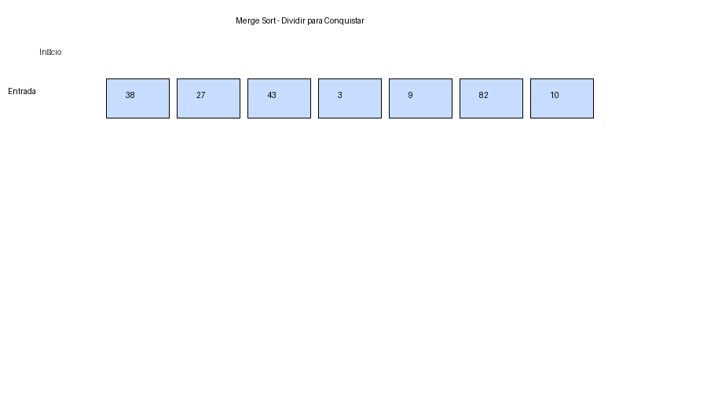
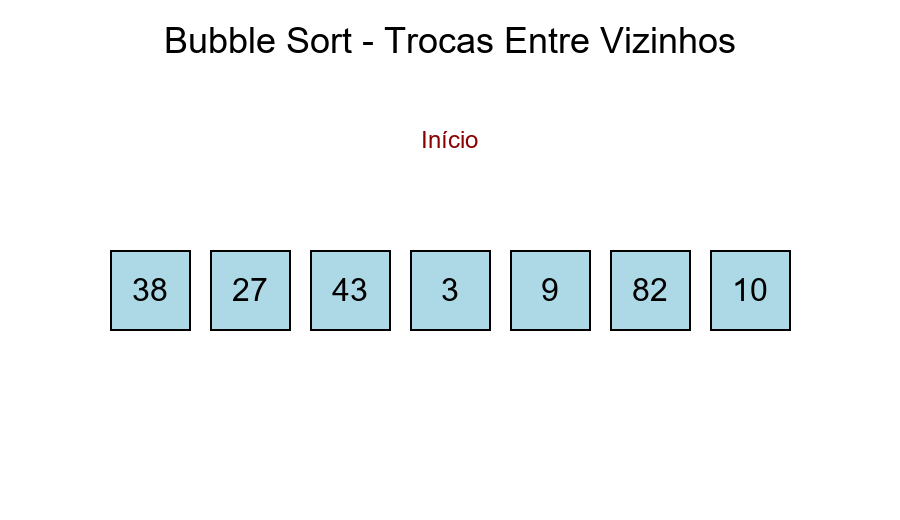
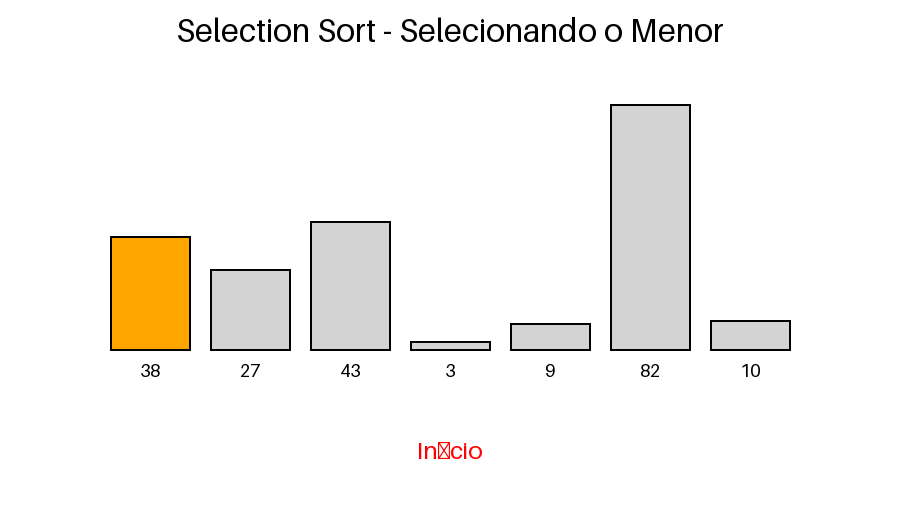
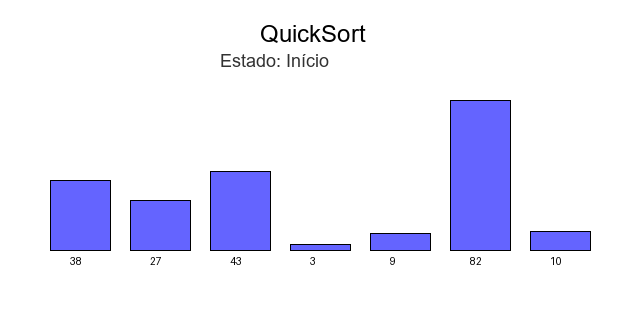

# Estrutura de Dados - 2026/04/23

## Algoritmos de Ordenação

Algoritmos de ordenação são técnicas usadas para organizar dados em uma ordem específica, como crescente ou decrescente. Eles são fundamentais em Estrutura de Dados porque facilitam busca, filtragem, comparação e apresentação de informações.

### Principais características

- "Critério de ordenação": define como os elementos serão comparados.
- "Estabilidade": um algoritmo estável mantém a ordem relativa de elementos iguais.
- "Complexidade": mede o custo de tempo e, em alguns casos, de memória.
- "In-place": indica se a ordenação ocorre com uso mínimo de memória extra.

### Exemplos de algoritmos

- "Bubble Sort": compara elementos vizinhos e troca quando necessário. É simples, mas pouco eficiente para grandes volumes de dados.
- "Selection Sort": seleciona repetidamente o menor elemento e o coloca na posição correta.
- "Insertion Sort": insere cada elemento na posição adequada em uma sequência parcialmente ordenada. Funciona bem em listas pequenas ou quase ordenadas.
- "Merge Sort": divide o conjunto em partes menores, ordena e depois combina. É eficiente e estável, mas usa memória extra.
- "Quick Sort": escolhe um pivô e particiona os elementos em menores e maiores. Costuma ser muito rápido na prática, embora o pior caso seja mais custoso.

### Resumo

Na prática, a escolha do algoritmo depende do tamanho dos dados, da necessidade de estabilidade, do uso de memória e do desempenho esperado. Para listas pequenas, algoritmos simples podem ser suficientes; para grandes volumes, métodos mais eficientes como Merge Sort ou Quick Sort costumam ser preferidos.

## Merge Sort

Merge Sort é um algoritmo de ordenação baseado na estratégia de dividir para conquistar. Ele divide a lista em partes menores, ordena cada parte e depois junta os resultados em uma única sequência ordenada.



```python
def merge_sort(lista):
	if len(lista) <= 1:
		return lista

	meio = len(lista) // 2
	esquerda = merge_sort(lista[:meio])
	direita = merge_sort(lista[meio:])

	return merge(esquerda, direita)


def merge(esquerda, direita):
	resultado = []
	i = j = 0

	while i < len(esquerda) and j < len(direita):
		if esquerda[i] <= direita[j]:
			resultado.append(esquerda[i])
			i += 1
		else:
			resultado.append(direita[j])
			j += 1

	resultado.extend(esquerda[i:])
	resultado.extend(direita[j:])
	return resultado


numeros = [38, 27, 43, 3, 9, 82, 10]
print(merge_sort(numeros))
```

## Bubble Sort

Bubble Sort é um algoritmo simples que percorre a lista várias vezes, comparando elementos vizinhos e trocando suas posições quando estão fora de ordem. A cada passagem, o maior elemento “sobe” para o final da lista.

Embora seja fácil de entender e implementar, seu desempenho é baixo em listas grandes, com complexidade de tempo média e pior caso de **O(n²)**. Ainda assim, é útil para fins didáticos e para listas pequenas.



```python
def bubble_sort(lista):
	n = len(lista)

	for i in range(n):
		trocou = False

		for j in range(0, n - i - 1):
			if lista[j] > lista[j + 1]:
				lista[j], lista[j + 1] = lista[j + 1], lista[j]
				trocou = True

		if not trocou:
			break

	return lista


numeros = [38, 27, 43, 3, 9, 82, 10]
print(bubble_sort(numeros))
```

## Selection Sort

Selection Sort é um algoritmo de ordenação que divide a lista em duas partes: a parte já ordenada (no início) e a parte ainda não ordenada. Em cada passada, ele procura o menor elemento da parte não ordenada e o coloca na posição correta, trocando com o elemento da posição atual.

Ele é simples de entender e também trabalha **in-place** (sem usar estrutura auxiliar relevante). Sua complexidade de tempo no melhor, médio e pior caso é **O(n²)**, por isso costuma ser usado mais em contextos didáticos ou listas pequenas.



```python
def selection_sort(lista):
	n = len(lista)

	for i in range(n):
		indice_menor = i

		for j in range(i + 1, n):
			if lista[j] < lista[indice_menor]:
				indice_menor = j

		if indice_menor != i:
			lista[i], lista[indice_menor] = lista[indice_menor], lista[i]

	return lista

numeros = [38, 27, 43, 3, 9, 82, 10]
print(selection_sort(numeros))
```

## QuickSort

QuickSort é um algoritmo eficiente que também segue a estratégia de dividir para conquistar. Ele escolhe um elemento como pivô, reorganiza a lista de forma que os menores fiquem à esquerda e os maiores à direita, e repete o processo recursivamente nas duas partes.

Na prática, QuickSort costuma ter ótimo desempenho médio, com complexidade de **O(n log n)**, e é muito utilizado em cenários reais. No pior caso (quando as divisões ficam muito desbalanceadas), pode chegar a **O(n²)**.



```python
def quick_sort(lista, inicio=0, fim=None):
	if fim is None:
		fim = len(lista) - 1

	if inicio < fim:
		indice_pivo = particionar(lista, inicio, fim)
		quick_sort(lista, inicio, indice_pivo - 1)
		quick_sort(lista, indice_pivo + 1, fim)

	return lista

def particionar(lista, inicio, fim):
	pivo = lista[fim]
	i = inicio - 1

	for j in range(inicio, fim):
		if lista[j] <= pivo:
			i += 1
			lista[i], lista[j] = lista[j], lista[i]

	lista[i + 1], lista[fim] = lista[fim], lista[i + 1]
	return i + 1

numeros = [38, 27, 43, 3, 9, 82, 10]
print(quick_sort(numeros))
```
