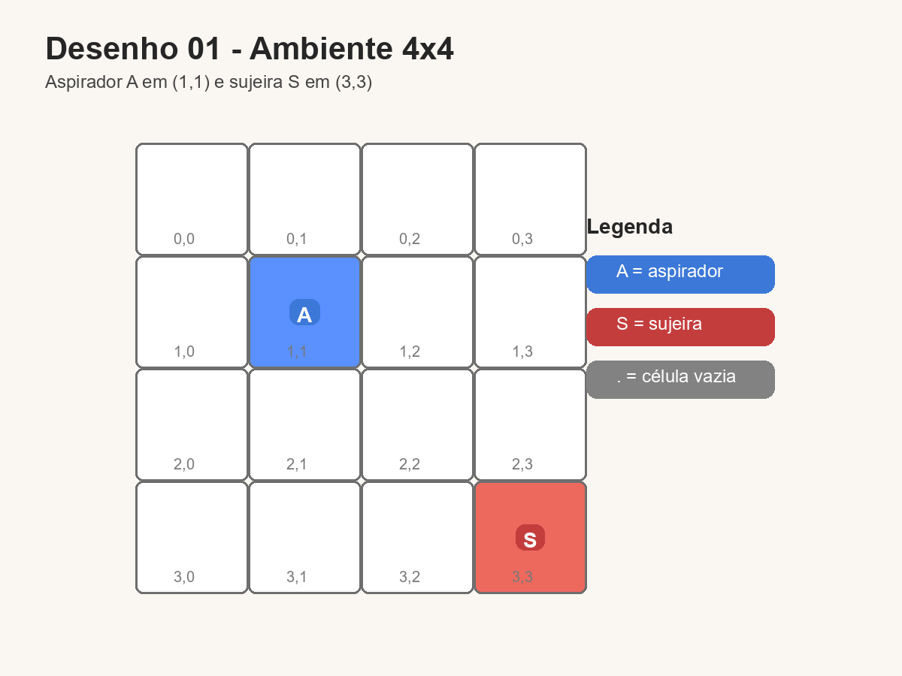
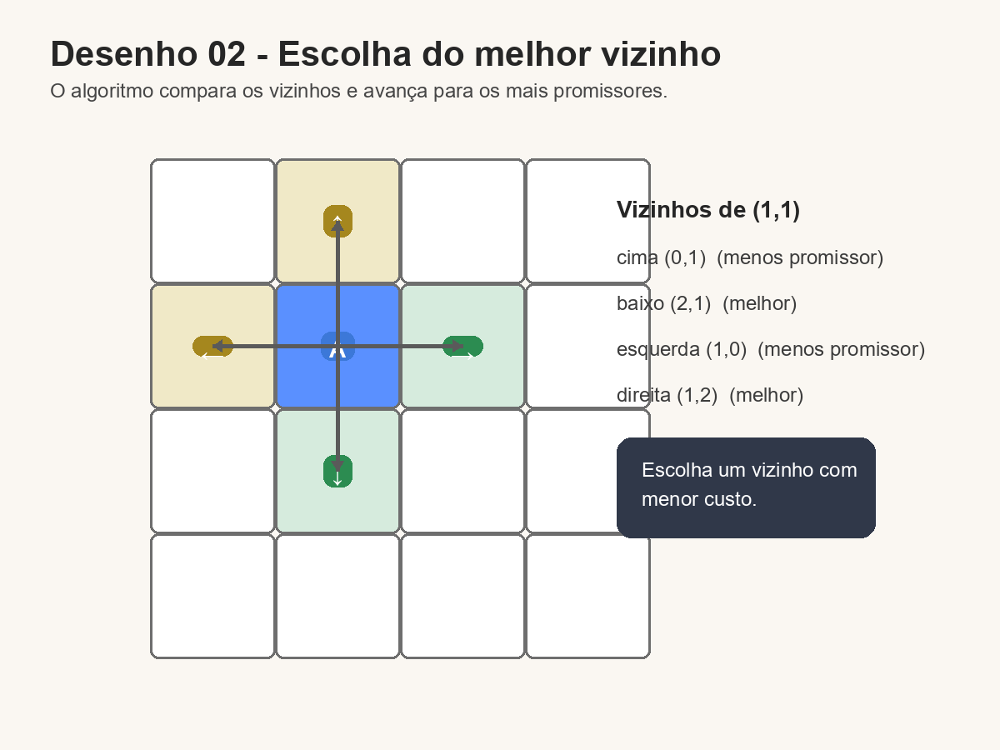
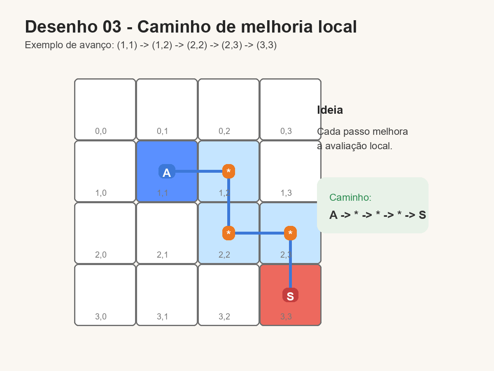
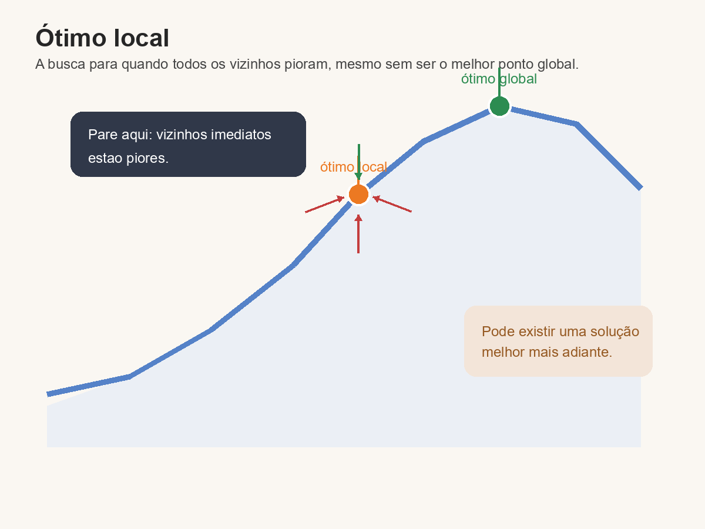

# Introdução a Inteligencia Artificial - 2026/05/11

## Algoritmo Genético

### Algoritmo Genético no problema do aspirador 4x4

O Algoritmo Genético (AG) é uma técnica de busca e otimização inspirada no processo de evolução natural. Ele trabalha com uma população de soluções candidatas, avalia cada uma delas e, a partir das melhores, gera novas soluções por meio de seleção, cruzamento e mutação.

No exemplo do aspirador em um mundo bidimensional 4x4, cada indivíduo da população representa um caminho possível para o aspirador. Esse caminho é uma sequência de movimentos, como:

- cima
- baixo
- esquerda
- direita

Ou seja, a solução do problema não é apenas a posição final, mas o percurso construído pelo indivíduo até tentar alcançar a sujeira.

### Representação do indivíduo

Neste cenário, o cromossomo do indivíduo pode ser entendido como uma sequência de ações. Por exemplo:

`[direita, direita, cima, esquerda, cima]`

Se o aspirador começa em uma posição inicial no grid 4x4, essa sequência define por onde ele passa. Cada indivíduo da população corresponde a uma estratégia diferente de movimento.

### Função de custo

A função de custo usada no exemplo é a distância em linha reta até a sujeira, também chamada de distância euclidiana.

Se a posição atual do aspirador é `(x1, y1)` e a posição da sujeira é `(x2, y2)`, então o custo é:

\[
d = \sqrt{(x2 - x1)^2 + (y2 - y1)^2}
\]

Quanto menor essa distância, melhor é a solução, porque significa que o aspirador terminou mais perto da sujeira.

Como o algoritmo costuma trabalhar com aptidão em vez de custo, pode-se transformar esse valor em uma medida de qualidade. Uma forma simples é:

\[
aptidão = \frac{1}{1 + custo}
\]

Assim, soluções com menor custo recebem maior aptidão.

### Etapas do Algoritmo Genético

#### 1. Inicialização da população

O algoritmo começa gerando vários caminhos aleatórios para o aspirador. Cada caminho é um indivíduo da população.

Exemplo de população inicial:

- Indivíduo A: `[direita, cima, cima, direita]`
- Indivíduo B: `[esquerda, cima, direita, direita]`
- Indivíduo C: `[cima, cima, direita, baixo]`
- Indivíduo D: `[direita, direita, cima, cima]`

Cada solução é testada no ambiente 4x4 e recebe uma nota de acordo com a distância final até a sujeira.

#### 2. Avaliação

Depois de simular o caminho de cada indivíduo, calcula-se a distância entre a posição final do aspirador e a sujeira.

- Se o indivíduo termina perto da sujeira, o custo é baixo.
- Se termina longe, o custo é alto.

Essa etapa permite identificar quais caminhos são mais promissores.

#### 3. Seleção

Na seleção, os indivíduos com melhor desempenho têm maior chance de participar da criação da próxima geração. No caso do aspirador, os caminhos que deixam o agente mais próximo da sujeira são favorecidos.

Isso reproduz a ideia de “sobrevivência dos mais aptos”.

#### 4. Cruzamento

O cruzamento combina partes de dois indivíduos para gerar novos caminhos.

Exemplo:

- Pai 1: `[direita, direita, cima, esquerda]`
- Pai 2: `[cima, baixo, direita, direita]`

Após o cruzamento, pode surgir:

- Filho: `[direita, direita, direita, direita]`

A ideia é aproveitar trechos úteis de caminhos diferentes para produzir uma solução potencialmente melhor.

#### 5. Mutação

A mutação faz pequenas alterações aleatórias em alguns genes do indivíduo.

Exemplo:

- Antes: `[direita, direita, cima, esquerda]`
- Depois: `[direita, baixo, cima, esquerda]`

A mutação é importante porque mantém a diversidade da população e evita que o algoritmo fique preso em soluções muito parecidas ou pouco eficientes.

#### 6. Nova geração

Depois da seleção, do cruzamento e da mutação, forma-se uma nova população. Esse processo se repete por várias gerações, sempre tentando reduzir o custo e aproximar o aspirador da sujeira.

### Aplicação ao mundo 4x4

No ambiente 4x4, o aspirador pode se mover dentro de uma grade limitada. O algoritmo testa diferentes caminhos e mede o resultado pela distância final até a sujeira.

Se o indivíduo termina em uma posição próxima ao alvo, ele é considerado melhor. Com isso, o AG vai refinando os caminhos ao longo das gerações.

Importante: nesse exemplo, o objetivo não é necessariamente encontrar o menor número de passos, mas sim o caminho cujo estado final fique mais próximo da sujeira, porque a avaliação foi definida pela distância em linha reta.

### Exemplo conceitual

Suponha que:

- posição inicial do aspirador: `(1, 1)`
- posição da sujeira: `(3, 3)`

Dois indivíduos diferentes podem produzir os seguintes resultados:

- Indivíduo A termina em `(2, 2)`
- Indivíduo B termina em `(0, 3)`

As distâncias até a sujeira seriam diferentes, e o indivíduo que terminar mais perto terá melhor aptidão. Esse é o critério usado para decidir quais caminhos devem permanecer e gerar descendentes.

### Vantagens do Algoritmo Genético

- Funciona bem em espaços de busca grandes.
- Não precisa conhecer a solução exata de antemão.
- Pode lidar com problemas difíceis de resolver por métodos diretos.
- Explora várias possibilidades ao mesmo tempo.

### Resumo

No exemplo do aspirador 4x4:

- Indivíduo = caminho percorrido.
- Cromossomo = sequência de movimentos.
- Função de custo = distância em linha reta até a sujeira.
- Seleção = privilegia os caminhos mais próximos do alvo.
- Cruzamento = combina partes de caminhos bons.
- Mutação = altera pequenas partes do caminho.

Assim, o Algoritmo Genético evolui os caminhos da população até encontrar trajetórias cada vez melhores para o aspirador alcançar a sujeira.

## Algoritmo Descida da Colina

### Descida da Colina no problema do aspirador 4x4

O **Algoritmo Descida da Colina (Hill Climbing)** é uma estratégia de busca local.
Ele parte de uma solução inicial e tenta melhorá-la passo a passo, sempre escolhendo um vizinho que tenha avaliação melhor.

No mesmo mundo do aspirador 4x4:

- Estado = posição atual do aspirador no grid.
- Vizinhos = posições alcançáveis com um movimento (cima, baixo, esquerda, direita).
- Função de avaliação = distância até a sujeira (quanto menor, melhor).

---

### Ideia principal

1. Começa em uma posição inicial.
2. Avalia os vizinhos possíveis.
3. Vai para o vizinho com menor custo (mais perto da sujeira).
4. Repete até não encontrar vizinho melhor.

Quando não existe melhora, o algoritmo para.

---

### Desenho 1: ambiente 4x4



Legenda:

- `A` = aspirador
- `S` = sujeira (alvo)
- `.` = célula vazia

Estado inicial:

```text
	y→ 0   1   2   3
x
0     .   .   .   .
1     .   A   .   .
2     .   .   .   .
3     .   .   .   S
```

Exemplo: `A = (1,1)` e `S = (3,3)`.

---

### Desenho 2: escolha do melhor vizinho



Vizinhos de `(1,1)`:

- cima `(0,1)`
- baixo `(2,1)`
- esquerda `(1,0)`
- direita `(1,2)`

Se usamos distância até `S(3,3)`, os vizinhos mais promissores são `(2,1)` e `(1,2)`.

```text
Passo atual: (1,1)

				(0,1)
					↑
(1,0)  ←    (1,1)    →  (1,2)  [melhor]
					↓
				(2,1)  [melhor]
```

O algoritmo escolhe um dos melhores e avança.

---

### Desenho 3: caminho de melhoria local



Um possível percurso:

```text
(1,1) -> (1,2) -> (2,2) -> (2,3) -> (3,3)
```

Visualmente:

```text
	y→ 0   1   2   3
x
0     .   .   .   .
1     .   A   *   .
2     .   .   *   *
3     .   .   .   S
```

`*` indica posições escolhidas por melhoria local.

---

### Ponto importante: ótimo local



A Descida da Colina pode parar em uma solução que é melhor que as vizinhas imediatas, mas não é a melhor global.

Desenho conceitual:

```text
Avaliação
  ^
  |               ___ topo global
  |      ___
  |  ___/   \___
  |_/             \____
  +--------------------------> estados
		^
		pode parar aqui (ótimo local)
```

No grid, isso acontece quando todos os movimentos possíveis pioram a avaliação atual, mesmo que exista um caminho melhor mais adiante.

---

### Vantagens

- Simples de implementar.
- Rápido para encontrar melhorias locais.
- Usa pouca memória.

### Limitações

- Pode ficar preso em ótimo local.
- Pode parar em platôs (vizinhos com mesma avaliação).
- Depende da posição inicial.

### Resumo

No exemplo do aspirador 4x4, a Descida da Colina:

- avalia os movimentos vizinhos;
- escolhe sempre o que mais aproxima da sujeira;
- repete até não haver melhora.

É uma busca gulosa local: eficiente e prática, mas sem garantia de encontrar sempre a melhor solução global.
