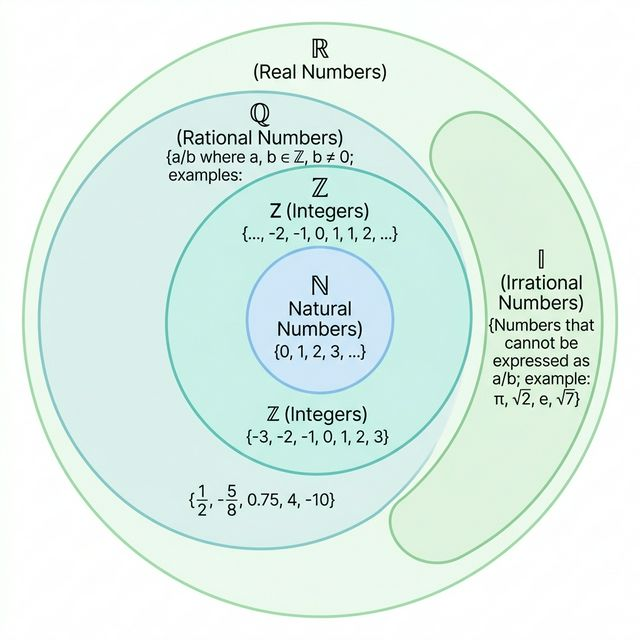
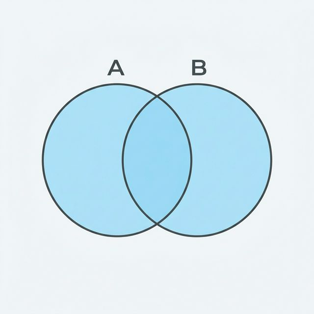
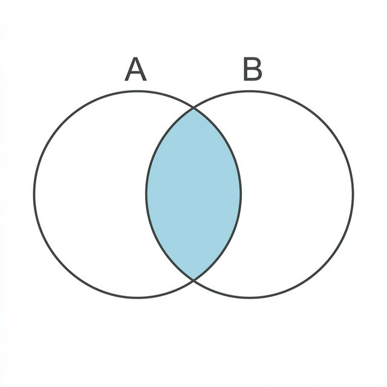
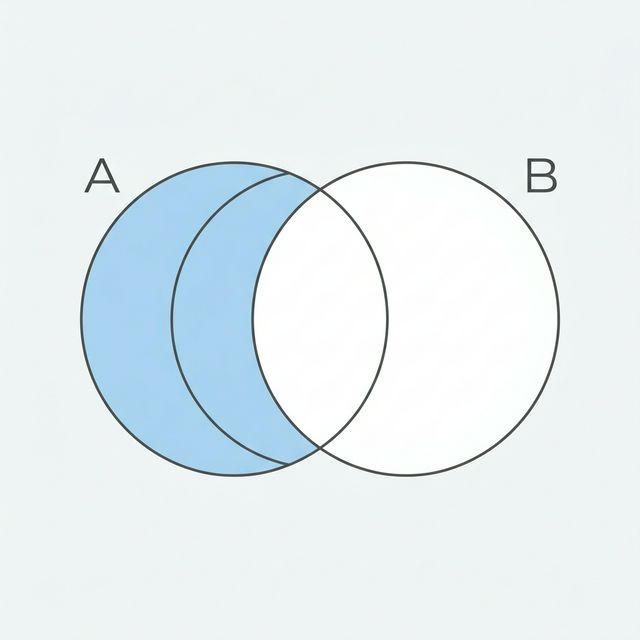
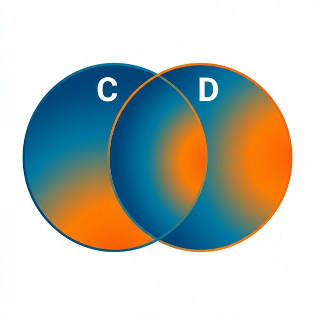
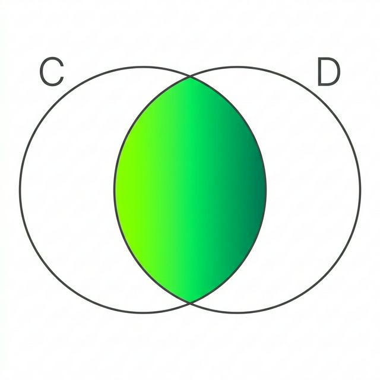
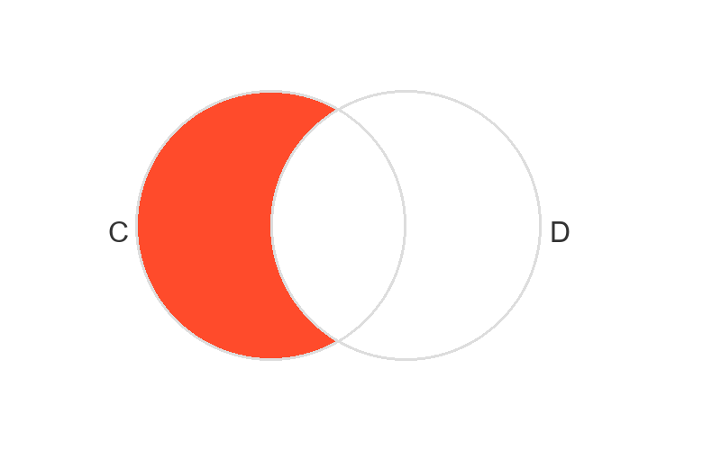
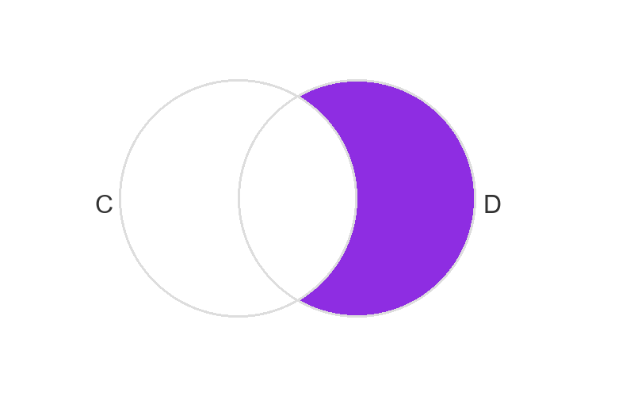

# Matematica - aula 2026/03/27

Estatística

## Conjuntos Numericos

### Chaves

São conjuntos abertos, ou seja, não incluem os extremos.

Exemplos:

"{...}"

### Colchetes

São intervalos fechados, ou seja, incluem os extremos.

Exemplos:

- "[inicio;fim]"

- "]inicio;fim]"

- "[inicio;fim["

- "]inicio;fim["

## Diagrama de Venn

## Elemento ou subconjunto

### Elemento

É um item que pertence a um conjunto.

Exemplos:

- "1"

- "2"

- "3"

### Subconjunto

É um conjunto que pertence a um conjunto.

Exemplos:

- "{1, 2, 3}"

- "{1, 2}"

- "{1, 3}"

- "{2, 3}"

## Simbologia da Matematica

- "∈" - pertence

- "∉" - não pertence

- "⊂" - está contido em

- "⊄" - não está contido em

- "∪" - união

- "∩" - interseção

- "∅" - conjunto vazio

## Um conjunto é um subconjunto de si mesmo

Exemplo:

- "{1, 2, 3}" é um subconjunto de "{1, 2, 3}"

## Vazio é subconjunto de qualquer conjunto

Exemplo:

- "∅" é um subconjunto de "{1, 2, 3}"

## Tente isso...

Seja B = {a; b; c}. Escreva todos os subconjuntos de B.

Resposta:

- "∅"

- "{a}"

- "{b}"

- "{c}"

- "{a, b}"

- "{a, c}"

- "{b, c}"

- "{a, b, c}"

Um conjunto com "n" elementos tem "2^n" subconjuntos.

## União, Intersecção e Diferença

### União

É a união de dois ou mais conjuntos.

Exemplos:

- "{1, 2, 3} ∪ {3, 4, 5} = {1, 2, 3, 4, 5}"

- "{1, 2, 3} ∪ {4, 5, 6} = {1, 2, 3, 4, 5, 6}"

### Intersecção

É a intersecção de dois ou mais conjuntos.

Exemplos:

- "{1, 2, 3} ∩ {3, 4, 5} = {3}"

- "{1, 2, 3} ∩ {4, 5, 6} = ∅"

### Diferença

É a diferença de dois ou mais conjuntos.

Exemplos:

- "{1, 2, 3} - {3, 4, 5} = {1, 2}"

- "{1, 2, 3} - {4, 5, 6} = {1, 2, 3}"

### Diagramas de Venn

União:

Intersecção:

Diferença:

###

Quando Y é um suconjunto de X, mas não igual a X, então "X - Y" é complemento de Y em relação a X.

Exemplo:

- "{1, 2, 3} - {1, 2} = {3}"

## Tente isso...

Seja A = {1, 2, 3} e B = {3, 4, 5}. Calcule:

- "A ∪ B"

- "A ∩ B"

- "A - B"

- "B - A"

Resposta:

- "A ∪ B = {1, 2, 3, 4, 5}"

- "A ∩ B = {3}"

- "A - B = {1, 2}"

- "B - A = {4, 5}"

## Tente isso também...

Seja C = [-2; 5] e D = ]1; 8]. Calcule:

- "C ∪ D"

- "C ∩ D"

- "C - D"

- "D - C"

Resposta:

- "C ∪ D = [-2; 8]"

- "C ∩ D = ]1; 5]"

- "C - D = [-2; 1]"

- "D - C = ]5; 8]"

Em imagens:

C ∪ D = [-2; 8]

C ∩ D = ]1; 5]

C - D = [-2; 1]

D - C = ]5; 8]

